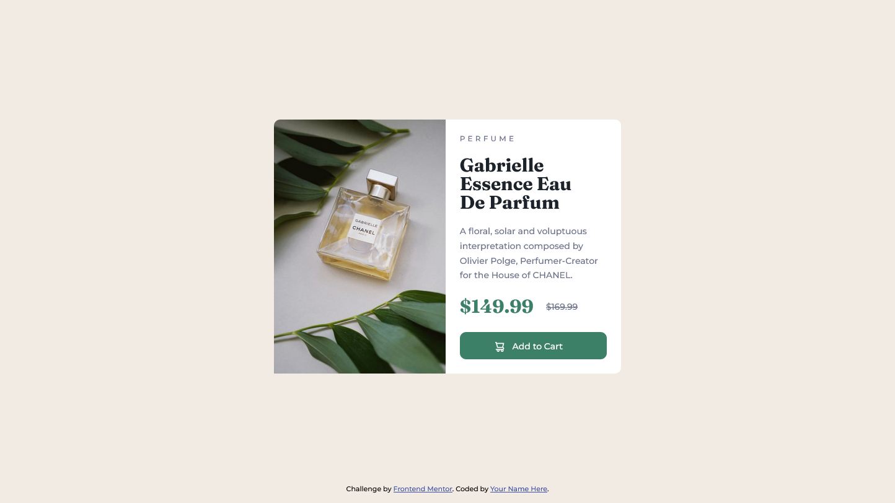

# Frontend Mentor - Product preview card component solution

This is a solution to the [Product preview card component challenge on Frontend Mentor](https://www.frontendmentor.io/challenges/product-preview-card-component-GO7UmttRfa). Frontend Mentor challenges help you improve your coding skills by building realistic projects. 

## Table of contents

- [Overview](#overview)
  - [The challenge](#the-challenge)
  - [Screenshot](#screenshot)
  - [Links](#links)
- [My process](#my-process)
  - [Built with](#built-with)
  - [What I learned](#what-i-learned)
  - [Continued development](#continued-development)
  - [Useful resources](#useful-resources)
- [Author](#author)


**Note: Delete this note and update the table of contents based on what sections you keep.**

## Overview

### The challenge

Users should be able to:

- View the optimal layout depending on their device's screen size
- See hover and focus states for interactive elements

### Screenshot




### Links

- Solution URL: [Add solution URL here](https://your-solution-url.com)
- Live Site URL: [Add live site URL here](https://mauritzlm.github.io/product-preview-card/)

## My process

### Built with

- Semantic HTML5 markup
- CSS custom properties
- Flexbox
- Mobile-first workflow

### What I learned

This challenged allowed me to get practice with positioning elements on the page.
I used a combination of line height, letter spacing, font size, margin, padding and the position property to place elements according to the design.

This code moved the cart icon a little down and to the left.
```css
.add-button img {
    position: relative;
    right: 9px;
    top: 4px;
}
```
Working on challenges that has to be responsive makes me think more carefully about how I need to structure my html markup and my style sheet.

I learned about using the delete element and hiding content visually but not for screen readers, after feedback from @MelvinAguilar.

### Continued development

1. I want to continue learning about the best practices of which units to use. For example with padding: px or em.
2. I want to get better at structuring a style sheet. 

### Useful resources

- [css tricks flexbox article](https://css-tricks.com/snippets/css/a-guide-to-flexbox/) - I like to use this article as a guide when I'm using flexbox.
- [mdn responsive images guide](https://developer.mozilla.org/en-US/docs/Learn/HTML/Multimedia_and_embedding/Responsive_images) - This guide describes the art direction problem (displaying a different image depending on the screen size) and how to use the picture element to resolve it.
- [css tricks inclusively hidden article](https://css-tricks.com/inclusively-hidden/) - The article provides a ruleset to hide an element visually but not from screen readers.

## Author

- Frontend Mentor - [@MauritzLM](https://www.frontendmentor.io/profile/MauritzLM)

## Acknowledgments

@MelvinAguilar gave feedback to my submitted solution. It helped me to make accessibility improvements and improve the desktop layout.  


